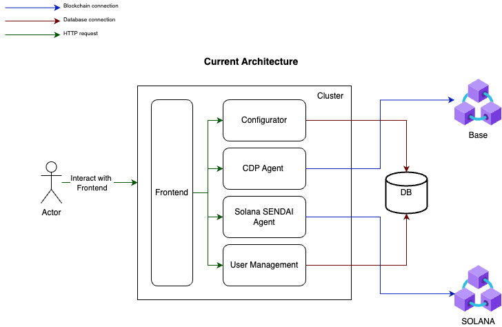
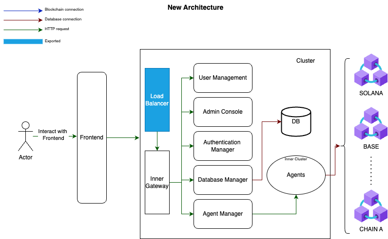

# NexWallet

## Overview

NexWallet is a cutting-edge platform that combines blockchain technology with artificial intelligence to provide a seamless and intelligent wallet management experience. It supports multiple blockchain networks and offers unique features such as AI-driven transaction signing.

## Key Features

- **Multi-Chain Support**: Solana, Base, Ethereum, Arbitrum, and more.
- **AI-Driven Interactions**: Text and voice command capabilities.
- **Unique Transaction Signing**: First platform to offer AI agent transaction signing.
- **Real-Time Data Integration**: Utilizes Cookie DataSwarm API for up-to-date blockchain data.
- **Robust Security**: Advanced authentication and security measures.

## Technical Documentation

### Architecture Overview

- **Frontend and Backend**: Built using Next.js, providing both frontend and backend functionalities.

### Agent Kits

- **SolanaAgentKit**: Facilitates interactions with the Solana blockchain.
- **CdpAgentkit**: Used for Base network interactions.

### AI Agent Configuration

- **AI Models**: Powered by OpenAI's GPT-4o, configured using the `createAgent` function.

### Database and API Integration

- **Prisma ORM**: Used for database interactions.
- **API Endpoints**: Detailed integration with external APIs for enhanced functionality.

## Codebase Insights

- **Solana Onchain Bot**: The README.md file describes the Solana Onchain Bot, which provides chat and voice interfaces for interacting with the SEND AI framework. It highlights modifications for transaction signing.
- **Base Network API**: The `pages/api/bot/base.ts` file configures the CDP AgentKit for the Base network, handling wallet data and initializing the agent for on-chain interactions.
- **Solana Network API**: The `pages/api/bot/solana.ts` file sets up the SolanaAgentKit, enabling transaction signing and interaction with the Solana blockchain.
- **Chat API**: The `pages/api/chat.ts` file handles chat interactions, determining if a message is about executing a blockchain transaction and processing it accordingly.
- **Knowledge Agent**: The `knowledge/createReactAgent.ts` file creates a knowledge-based AI agent using tools from the Cookie and Eigenlayer APIs.

# NexWallet Architecture Overview

## Current Architecture

The current architecture of **NexWallet** is structured around a simple interaction model between the user, frontend, and backend services, organized within a cluster.

- **Actor**: The user interacts directly with the **Frontend** through HTTP requests.
- **Frontend**: Acts as a bridge, sending HTTP requests to various backend components.
- **Cluster Components**:
  - **Configurator**: Handles configuration settings and parameters for the application.
  - **CDP Agent**: Manages the CDP (Collateralized Debt Position) functionalities.
  - **Solana SENDAI Agent**: Responsible for interfacing with the **Solana** blockchain.
  - **User Management**: Manages user-related functionalities and data.

- **Connections**:
  - **Database (DB)**: All agents and components interact with the database through database connections to store and retrieve data.
  - **Blockchain Connections**: The **Solana SENDAI Agent** connects to the **Solana** blockchain, while other agents like **CDP Agent** connect to **Base**.

---

## New Architecture

The new architecture introduces a more modular and scalable system to handle growing demands and future blockchain integrations.

- **Actor**: The interaction flow remains the same, with the user communicating through the **Frontend**.
- **Frontend Enhancements**:
  - **Load Balancer**: Introduced to manage incoming traffic, ensuring high availability and reliability.
  - **Inner Gateway**: A new component to streamline internal communication within the cluster.

- **Cluster Components**:
  - **User Management**: Continues to manage user data and functionalities.
  - **Admin Console**: A new addition for administrative controls and monitoring.
  - **Authentication Manager**: Introduced to handle user authentication and security protocols.
  - **Database Manager**: Manages database interactions more efficiently.
  - **Agent Manager**: Oversees the agents, ensuring smooth operations and coordination.
  
- **Inner Cluster**:
  - **Agents**: Consolidated under an **Inner Cluster** to streamline interactions with multiple blockchains and the database.

- **Connections**:
  - **Database (DB)**: All managers and agents interact with the database through structured database connections.
  - **Blockchain Connections**: Expanded to support multiple chains (**Solana**, **Base**, and future integrations like **Chain A**).

---

## Key Changes from Current to New Architecture

1. **Load Balancer Introduction**: Ensures better traffic management and high availability of services.
2. **Inner Gateway**: Simplifies and secures internal communication between frontend and backend services.
3. **Modular Managers**:
   - **Authentication Manager** enhances security.
   - **Database Manager** improves data handling efficiency.
   - **Agent Manager** provides better control and coordination of blockchain interactions.
4. **Admin Console**: Provides a dedicated interface for system administrators to manage and monitor the platform.
5. **Inner Cluster for Agents**: Groups agents together for more efficient blockchain interactions and scalability.
6. **Multi-Chain Support**: Expanded capability to interact with additional blockchains beyond **Solana** and **Base**.

---

This architectural evolution aims to improve scalability, security, and maintainability while preparing **NexWallet** for future growth and blockchain integrations.

## Main changes done in SEND AI

- SolanaAgentKit now includes a callback mechanism.
    

- Private keys are no longer mandatory; public keys can also be used. When using a public key, the UI mode variable must be set to true.
    
